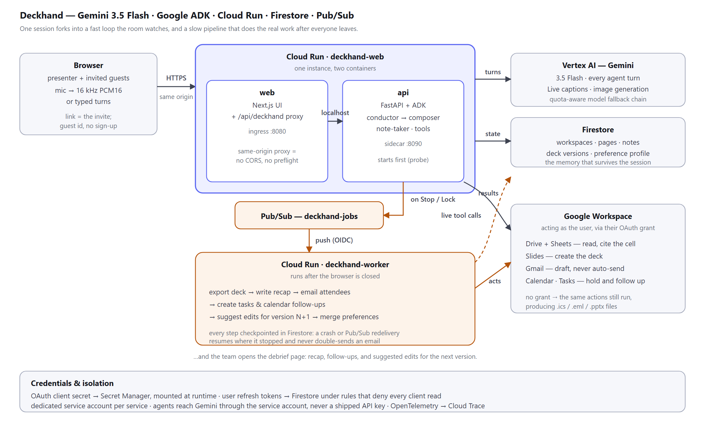

# Deckhand

**An agent that sits in your working session: it listens, builds the artifact live from
your real data, then — after everyone leaves — exports it, emails the recap, and books
the follow-ups.**

Built for the **All Things Agentic Hackathon** (Track: **The Collaborative Partner**) on
**Gemini 3.5 Flash + Google ADK + Google Cloud**.

- **Live app:** https://deckhand-web-cfsfhlwh7q-uc.a.run.app
- **Architecture:** [`docs/architecture.png`](docs/architecture.png)
- **Product flow:** [`PROJECT_FLOW.txt`](PROJECT_FLOW.txt)

Deckhand has two surfaces over one agent runtime:

| Surface | What it is |
|---|---|
| **Working session** (`/w/{id}`) | The demo. People talk; a conductor agent decides what to do and a composer agent writes the page. It reads your Drive, searches the web, generates visuals, and reaches for Gmail / Calendar / Slides when the conversation calls for it. |
| **Presentation pipeline** (`/p/{pid}`) | Interview → outline → build → **lock** → present (listen-only note-taker) → debrief. Stopping a talk hands the follow-up work to the background worker. |

## Architecture



One Cloud Run service runs **two containers**: the Next.js UI (ingress `:8080`) and the
FastAPI + ADK agent runtime as a **sidecar** (`:8090`). The browser only ever talks to
its own origin — `/api/deckhand/*` is proxied to the sidecar over `localhost`, so there
is no CORS, no preflight, and no public hop between UI and API. A second service,
`deckhand-worker`, is woken by an authenticated Pub/Sub push after a session ends.

- **Models:** `gemini-3.5-flash` (every agent turn + server-side speech-to-text),
  `gemini-live-2.5-flash` (streaming captions), `gemini-3.1-flash-image` (page visuals),
  with a quota-aware fallback chain so a rate-limited model can't kill a live session.
- **Design rule:** the agent may edit **before** a talk, never during. While presenting
  it is listen-only; its sole screen action is optional next-slide navigation.
- **Reliability:** every worker step checkpoints to `jobs/{id}.steps_done`, so a crash or
  a Pub/Sub redelivery resumes instead of re-sending an email.
- **Degradation is designed, not accidental:** without a Google grant the same actions
  still run and produce `.ics` / `.eml` / `.pptx` files; the session feed says which
  path it took.

## Repo layout

```
backend/     FastAPI + google-adk. Agents, session loop, tools, Gemini Live broker.
worker/      Pub/Sub push handler: export → recap → email → follow-ups → preferences.
frontend/    Next.js app. Includes app/api/deckhand/[...path] — the same-origin proxy.
deploy/      setup.sh, deploy.sh, service-web.yaml (multi-container), deliver_job.sh
docs/        architecture diagram, thumbnail
testclient/  single-file dev harness for hitting the API without the UI
firestore.rules   clients read their own data; every write goes through the API
```

## Prerequisites

- Google Cloud project with billing
- `gcloud` CLI: `gcloud auth login && gcloud auth application-default login`
- Python 3.12+, Node 20+
- An **OAuth 2.0 Client ID (Web application)** (APIs & Services → Credentials) for
  user-consented Drive / Slides / Gmail / Calendar access. Add your redirect URIs:
  `http://localhost:8090/auth/google/callback` and, once deployed,
  `https://<your-web-service>/api/deckhand/auth/google/callback`

## Run locally

> **Windows:** run `bash deploy/*.sh` from **Git Bash**. Use **PowerShell for `gcloud`
> commands that take `/`-prefixed values** — Git Bash's path conversion rewrites them
> into Windows paths, silently, inside the build. PowerShell equivalent for the sync
> step: `.\deploy\sync_shared.ps1`.

```bash
# 0) shared modules the worker imports from backend/
bash deploy/sync_shared.sh

# 1) API  (terminal 1)
cd backend
python -m venv .venv && source .venv/bin/activate   # Windows: .venv\Scripts\activate
pip install -r requirements.txt
cp .env.example .env        # fill in project id + OAuth client id/secret
uvicorn app.main:app --reload --port 8090

# 2) worker  (terminal 2)
cd worker
python -m venv .venv && source .venv/bin/activate
pip install -r requirements.txt
uvicorn app.main:app --reload --port 8081

# 3) frontend  (terminal 3)
cd frontend
npm install
npm run dev                 # http://localhost:3000
```

`frontend/.env.local`:

```
NEXT_PUBLIC_API_BASE=http://localhost:8090
```

Locally there is no Pub/Sub push, so hand a job to the worker yourself:

```bash
bash deploy/deliver_job.sh <job_id>       # job ids are returned by lock / stop / feedback
```

### Running without Google Cloud credentials

Firestore and Pub/Sub need Application Default Credentials. For UI work you can swap
both for on-disk stand-ins — Gemini still runs for real via `GOOGLE_API_KEY`:

```bash
# in backend/.env and worker/.env
GOOGLE_GENAI_USE_VERTEXAI=false
GOOGLE_API_KEY=<your Gemini API key>
LOCAL_STORE=true
LOCAL_STORE_PATH=/absolute/path/to/repo/.localstore.json   # shared by both services
WORKER_URL=http://localhost:8081                           # local Pub/Sub stand-in
```

`app/localstore.py` implements the slice of the Firestore client the repository layer
uses, backed by one JSON file; `pubsub.enqueue` POSTs the push envelope straight at the
worker. **Never set `LOCAL_STORE` in Cloud Run.**

## Reproducible testing

A ten-minute path that exercises every subsystem, with the exact lines to say.

1. **Health** — `curl localhost:8090/healthz` → `{"ok": true}` (and `:8081` for the worker).
2. **Connect Google** — open http://localhost:3000, click **Connect Google**, approve all
   scopes. (Unverified-app warning is expected; see *Known limitations*.)
3. **Session** — *New workspace* → name yourself → say or type:
   *"Let's put together a quick review page for our product launch."*
   The page should appear with the agent's reason beside it.
4. **Real data** — *"Pull the numbers from the revenue spreadsheet in Drive."*
   The feed should say **"from your Google Drive"** and figures should carry cell refs.
5. **Live web** — *"What's the market size for AI presentation tools? Look it up."*
6. **Real actions** — *"Hold thirty minutes Friday at 3pm"*, *"draft a follow-up email to
   <you>@gmail.com"*, *"export this as slides"* → check your Calendar, Gmail **Drafts**,
   and Drive. Feed wording tells you whether it hit the real API or the local fallback.
7. **Async pipeline** — in `/p/{pid}`: brief → outline → build → approve → **Lock**.
   Lock returns a job id → `bash deploy/deliver_job.sh <id>` → a deck appears in Drive.
   Then start a talk, push a transcript, **Stop**, deliver that job, and check the recap
   email, Google Task, and Calendar follow-up.
8. **Verify state** — `GET /jobs/<id>` shows `status` and `steps_done`; Firestore holds
   the workspace, its pages, notes and the preference profile.

## Deploy to Google Cloud

```bash
cp deploy/vars.env.example deploy/vars.env    # project id, region, bucket, OAuth client id
bash deploy/setup.sh                          # APIs, Firestore, bucket, Pub/Sub topic, SAs, secret
```

Build both images, then apply the multi-container service:

```bash
PROJECT=<your-project-id>
REPO=us-central1-docker.pkg.dev/$PROJECT/cloud-run-source-deploy

# API image (sidecar)
gcloud builds submit backend --tag $REPO/deckhand-api:latest --region us-central1

# UI image — NEXT_PUBLIC_API_BASE is baked in at build time and must be the proxy path.
# Run this from PowerShell on Windows; Git Bash mangles the leading slash.
gcloud builds submit frontend --region us-central1 \
  --pack image=$REPO/deckhand-web:proxy,env=NEXT_PUBLIC_API_BASE=/api/deckhand

# One service, two containers (edit the project id inside first)
gcloud run services replace deploy/service-web.yaml --region us-central1
gcloud run services add-iam-policy-binding deckhand-web --region us-central1 \
  --member allUsers --role roles/run.invoker
```

Worker + Pub/Sub push:

```bash
gcloud builds submit --config deploy/cloudbuild-worker.yaml .
gcloud run deploy deckhand-worker --image gcr.io/$PROJECT/deckhand-worker \
  --region us-central1 --no-allow-unauthenticated \
  --service-account deckhand-worker@$PROJECT.iam.gserviceaccount.com \
  --set-secrets GOOGLE_OAUTH_CLIENT_SECRET=oauth-client-secret:latest

gcloud pubsub subscriptions create deckhand-jobs-push --topic deckhand-jobs \
  --push-endpoint "$(gcloud run services describe deckhand-worker --region us-central1 \
     --format 'value(status.url)')/pubsub" \
  --push-auth-service-account deckhand-pubsub@$PROJECT.iam.gserviceaccount.com \
  --ack-deadline 600
```

Then add `https://<web-url>/api/deckhand/auth/google/callback` to the OAuth client's
redirect URIs, and `firebase deploy --only firestore:rules`.

Verify: `curl https://<web-url>/api/deckhand/healthz` → `{"ok": true}`.

## Frontend

Next.js App Router + TypeScript, CSS Modules over a token layer in `app/globals.css`.
Runtime dependencies are `next`, `react`, `react-dom`, `firebase` — no UI kit, no icon
package, no animation library.

- **Dark by default.** A deck is a white document; dark chrome makes it the brightest
  thing on screen. `SlideCanvas` keeps its own light palette in both themes, because
  that is how the deck will look on a projector. Light theme is a full peer.
- **Type is Google Sans** (`next/font/google`), plus Google Sans Code for mono. Dark mode
  applies `GRAD -25` so light-on-dark text is optically corrected without a metric change.
- **Motion uses Material 3 Expressive's published spring physics** — solved and sampled
  into CSS `linear()`, because a `cubic-bezier` cannot overshoot and settle the way a
  spring does. *Spatial* springs may overshoot; *effects* springs never bounce.
- **View transitions** via React's `ViewTransition`; a deck cover morphs from the
  dashboard card into the workspace.
- **Agent presence** is a deliberate vocabulary (`ui/Generating.tsx`): a shimmer while
  the agent thinks, a conic frame around what it is rewriting, a step trace for
  multi-stage work.
- Everything honours `prefers-reduced-motion`. `/styleguide` renders every primitive
  and all nine slide templates on one page.

Audio has three tiers, chosen automatically: **Gemini Live** over a WebSocket (preferred),
browser `SpeechRecognition`, then raw PCM posted to `/transcribe` for Gemini to
transcribe server-side — which is what makes the mic work in Brave, where
`SpeechRecognition` exists but silently returns nothing.

## API walkthrough

```
POST /workspaces                      create a session      GET /workspaces
POST /workspaces/{wid}/join           invite link = the invite (idempotent)
POST /workspaces/{wid}/utterance      one turn: agent decides, composes, and says why
POST /workspaces/{wid}/answer         answer the agent's clarifying question
POST /workspaces/{wid}/rate           thumbs on an action → preference profile
POST /workspaces/{wid}/transcribe     PCM window → text (browser STT fallback)
WS   /live/session/{wid}              mic → Gemini Live → utterances on natural pauses

POST /presentations …                 brief → outline → deck → lock
POST /presentations/{pid}/talks/start then WS /live/talk/{pid}/{tkid}
POST /presentations/{pid}/talks/{tkid}/stop   → post-talk pipeline
GET  /jobs/{jobId}                    background-job status and completed steps
GET  /auth/google/start|status        Workspace OAuth
```

## Known limitations

- **OAuth is in Testing mode.** Gmail/Drive are *restricted* scopes, so publishing needs
  Google verification (CASA). Test users get the real thing; everyone else gets the
  file-producing fallbacks. Refresh tokens issued in Testing mode expire after 7 days.
- **Guest identity is a capability token.** A random per-browser id lets teammates join
  from a link with no sign-up; anyone holding that id can act as that user. Firebase
  sign-in is wired as the upgrade path (`lib/firebase.ts`) and always outranks a guest id.
- **WebSockets do not traverse the same-origin proxy**, so the deployed app uses the REST
  transcription tier rather than the Live socket. Both run on Gemini.
- **Cold start is ~15s** because the UI deliberately waits for the API sidecar's startup
  probe; set `--min-instances 1` if that matters.

## Cost control

Both services scale to zero. Delete everything after judging:
`gcloud run services delete deckhand-web deckhand-worker --region us-central1`.

---
*Voice-driven slide tools inspired the idea of speaking to build slides. Deckhand
deliberately inverts the live part — during a talk the deck is locked and the agent only
listens — and owns the full before/after workflow. Built from scratch on Gemini, ADK and
Google Cloud for this hackathon.*
